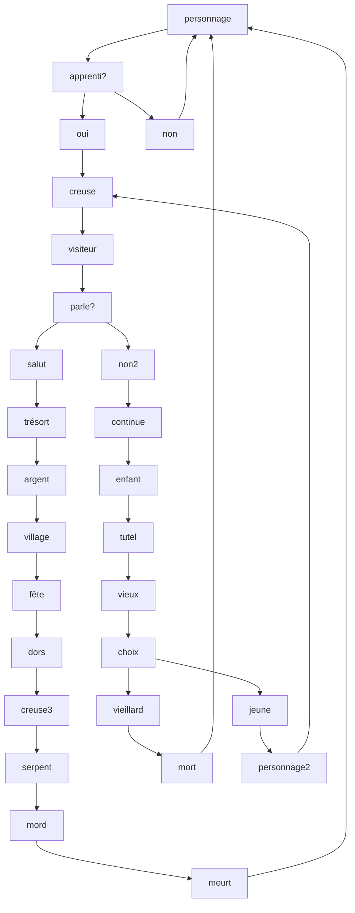

# Cycle Éco-Planétaire

## Par Keven Malric

### Idée derrière l'oeuvre
Le principe de l'oeuvre: **Cycle Éco-Planétaire** est de critiquer un manque de sens de la routine industrielle/humaine. Par l'immersion, de la réalité augmentée, **Cycle Éco-Planétaire** plonge ses participant dans un univers desertique ou il n'y a aucune végétation et ou le seul moyen d'avancer est de creusé vainment les sables pour des richesses temporaires. L'oeuvre en réalité virtuelle cherche à choquer par manque de progrès du point de vue de l'histoire afin de démontré la futilité des actions commises par l'avarice et l'envie humaine qui détruit notre environnement.

### Expérience recherchée

l'utilisateurs entre dans la pièce ou un musique désolante joue. il des entouré d'écran qui joue en boucle le paysage d'un désert. La victime met le casque VR et prend les manette. lorsqu'elle joue elle vit des sensation de non-sens et de désespoir.
Une fois que l'expérience est terminé, l'utilisateur est (*idéalement*) pris du sentiment d'insignifiance et réfléchit à ses actions écologiques.

### Les patentes qu'on a utilisés
systhème suround sound logithèque Z906 5.1 Speaker System. 4 projecteur lazer 4k Dangbei DBOX02 (Mars Pro 2), Meta Quest 3.

