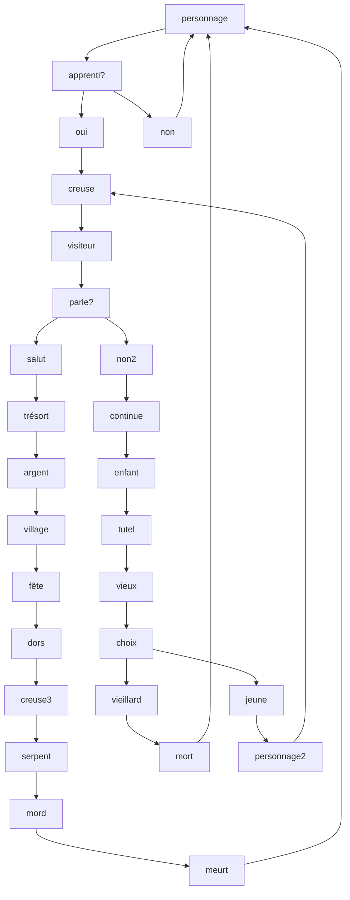

# docsify-modele-classique
modèle de page docsify pour une publication via page sans actions 


## Personalisation

### index.html

#### meta

Est utilisée pour inclure des métadonnées, comme des descriptions ou des informations relatives au contenu de la page, sans les afficher directement aux utilisateurs.

```html

<meta name="description" content="Modèle docsify pour publication classique">

```

#### title
Définit le titre de la page qui s'affiche dans l'onglet du navigateur et est utilisé par les moteurs de recherche comme le titre principal dans les résultats de recherche.

```html
<title>Modèle docsify pour publication classique</title>
```


#### window.$docsify 

##### name

Titre de la page affiché dans la barre de coté

```html
name: 'Modèle Docsify Classique',
```

##### repo

Lien vers le repository git du projet à documenter, cliquable depuis l'icone dans la barre de coté

```html
repo: 'https://github.com/gllmAR/docsify-modele-classique',
```


#### CSS (optionnelle)

Source et lien vers style CSS lié  [gllmAR/docsify-simple-style](https://github.com/gllmAR/docsify-simple-style/)




