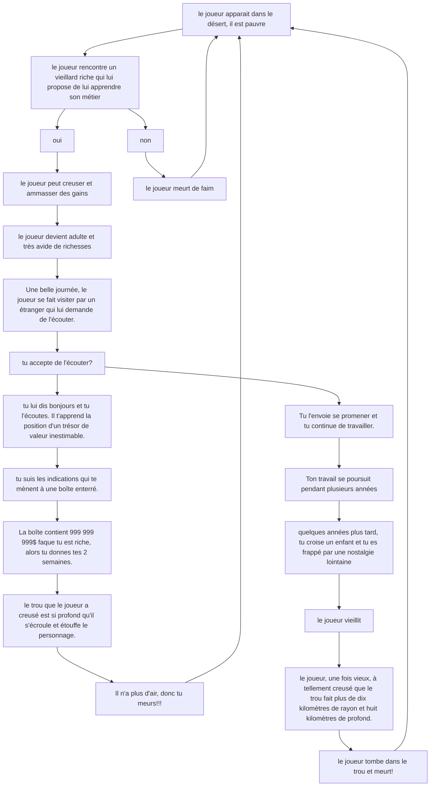

# Cycle Éco-Planétaire

## Par Keven Malric

### Idée derrière l'oeuvre

Le principe de l'oeuvre: **Cycle Éco-Planétaire** est de critiquer un manque de sens de la routine industrielle/humaine. Par l'immersion, de la réalité augmentée, **Cycle Éco-Planétaire** plonge ses participants dans un univers désertique ou il n'y a aucune végétation et ou le seul moyen d'avancer est de creuser vainement les sables pour des richesses temporaires. L'oeuvre en réalité virtuelle cherche à choquer par manque de progrès du point de vue de l'histoire afin de démontrer la futilité des actions commises par l'avarice et l'envie humaine qui détruit notre environnement.

### Expérience recherchée

l'utilisateurs entre dans la pièce ou une musique désolante joue. Il est entouré d'écrans qui joue en boucle le paysage d'un désert. La victime met le casque VR et prend les manettes. Lorsqu'elle joue, elle vit des sensations de non-sens et de désespoir.
Une fois que l'expérience est terminée, l'utilisateur est (*idéalement*) pris du sentiment d'insignifiance et réfléchit à ses actions écologiques.

### scénarimage

### Ambiance

https://github.com/user-attachments/assets/1ee875f3-ed10-4cb8-8650-370bab4d0c9c

https://github.com/user-attachments/assets/10e00f20-fe9d-447b-b1cc-1e9c92df50e0

### Les technologies utilisées

systhème suround sound logithèque Z906 5.1 Speaker System. 4 projecteurs laser 4k Dangbei DBOX02 (Mars Pro 2), Meta Quest 3, Unity.

